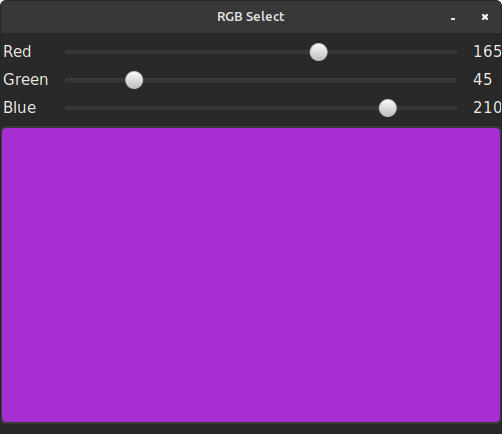
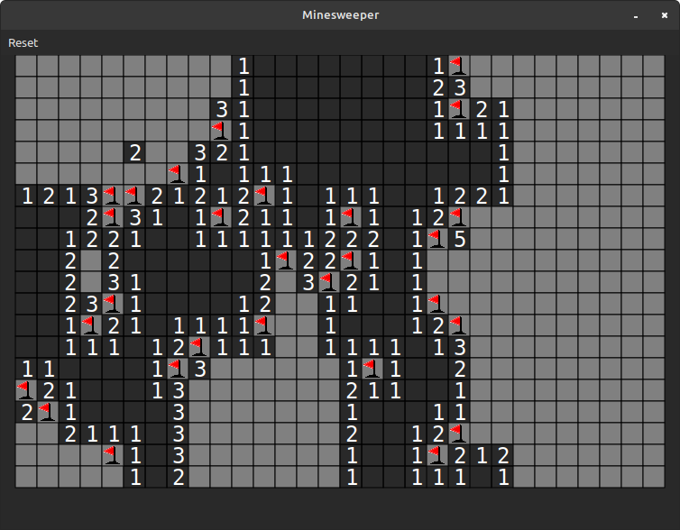
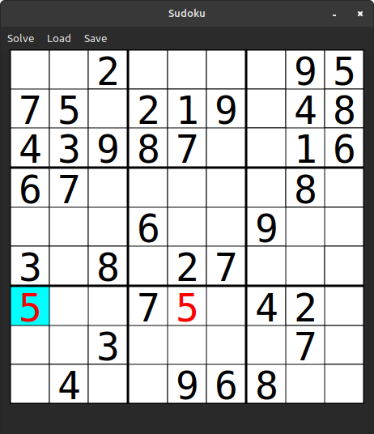
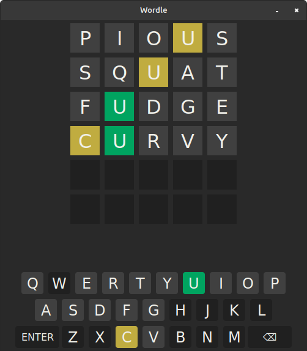

# druid-sandbox
Minor projects I've been doing to evaluate/learn the Druid UI toolkit for Rust (https://github.com/linebender/druid)

## Sub-projects:
- **rgb** : Simple RGB previewer with sliders for component colors.

- **minesweeper** : Minesweeper "clone"

- **sudoku** : Sudoku editor with solver

- **wordle** : Simple version of Wordle game

Each can executed via 'cargo run --bin [sub-project name]'

### WASM Versions

(Some minor modifications needed for menus and other things not "WASM-able")

- [Wordle](https://daltontf.github.io/wasm-wordle/)

- [Minesweeper](https://daltontf.github.io/wasm-minesweeper/)

- [Sudoku](https://daltontf.github.io/wasm-sudoku/)
